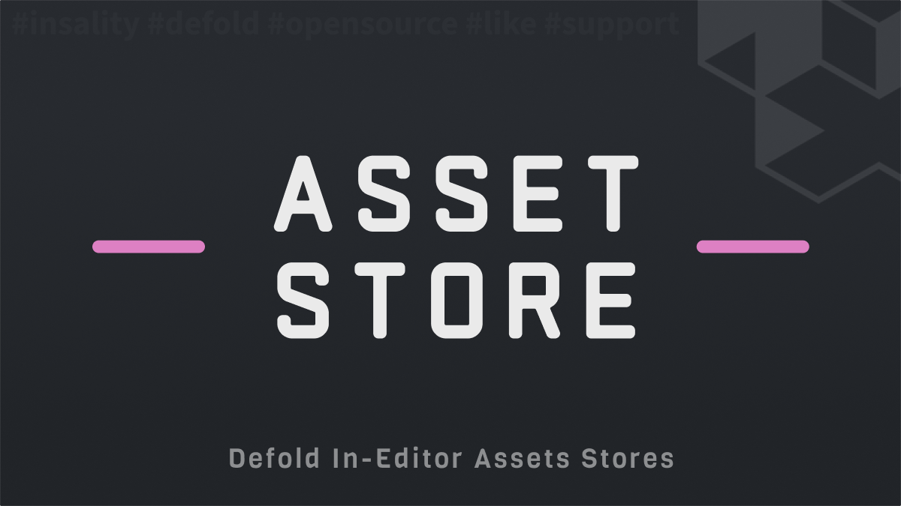

[](https://github.com/sponsors/insality) [](https://ko-fi.com/insality) [](https://www.buymeacoffee.com/insality)


# Disclaimer

The repository in **development stage** and not ready to use. But if you interested in the project, you can inspect what I'm building here :)

# Asset Store

**Asset Store** - is an editor script for the [Defold](https://defold.com/) game engine. It provides a convenient way to browse, publish and install assets (editor scripts, Druid's widgets, and other resources) directly from the Defold editor interface.

All assets will be copied to your project automatically after installation, so you can adjust or change them easily.

## Features

- **Browse Assets**: View available assets inside Defold Editor.
- **Search & Filter**: Search assets by title, author, description, or tags.
- **One-Click Installation**: Install assets directly into your project with automatic dependency resolution.
- **Multiple Stores**: Support for multiple asset stores.
- **Community Driven**: You can contribute by easily adding your own assets to the store.

## Setup

### [Dependency](https://www.defold.com/manuals/libraries/)

Open your `game.project` file and add the following line to the dependencies field under the project section:

**[Asset Store](https://github.com/Insality/core/archive/refs/tags/1.zip)**

```
https://github.com/Insality/core/archive/refs/tags/1.zip
```

After that, select `Project ▸ Fetch Libraries` to update [library dependencies](https://defold.com/manuals/libraries/#setting-up-library-dependencies). This happens automatically whenever you open a project so you will only need to do this if the dependencies change without re-opening the project.

The Asset Store editor script will be automatically available in the Defold editor menu under `Project ▸ [Asset Store] {Store Name}`.

## Usage

### Basic Usage

After installing the dependency, the Asset Store will appear in your Defold editor menu:

1. Open Defold Editor
2. Go to `Project` menu
3. Select `[Asset Store] {Store Name}` to open the store
4. Browse, search, and install assets

### Stores

- [Editor Scripts](/assets_editor_scripts_store.md)
- [Druid Widgets](/druid_widget_store.md)

## License

This project is licensed under the MIT License - see the LICENSE file for details.


## Issues and suggestions

If you have any issues, questions or suggestions please [create an issue](https://github.com/Insality/core/issues).


## 👏 Contributors

<a href="https://github.com/Insality/core/graphs/contributors">
  
</a>


## Changelog
<details>

### **V1**
- Initial release
- Asset Store editor script with browse, search, and install functionality
- Support for Editor Scripts and Druid Widgets stores
- Dependency resolution during installation

</details>


## ❤️ Support project ❤️

Love what I'm building for **Defold**? Your support means the world to me! Consider buying me a coffee ☕ or a donut 🍩 - it helps me keep creating awesome tools for the community.

[](https://github.com/sponsors/insality) [](https://ko-fi.com/insality) [](https://www.buymeacoffee.com/insality)

