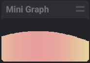

# widget.mini_graph API



> at widget/insality/mini_graph/mini_graph.lua

Widget to display a several lines with different height in a row
Init, set amount of samples and max value of value means that the line will be at max height
Use `push_line_value` to add a new value to the line
Or `set_line_value` to set a value to the line by index
Setup colors inside template file (at minimum and maximum)

## Functions

- [init](#init)
- [on_remove](#on_remove)
- [clear](#clear)
- [set_samples](#set_samples)
- [get_samples](#get_samples)
- [set_line_value](#set_line_value)
- [get_line_value](#get_line_value)
- [push_line_value](#push_line_value)
- [set_max_value](#set_max_value)
- [set_line_height](#set_line_height)
- [get_lowest_value](#get_lowest_value)
- [get_highest_value](#get_highest_value)
- [on_drag_widget](#on_drag_widget)
- [toggle_hide](#toggle_hide)

## Fields

- [root](#root)
- [text_header](#text_header)
- [icon_drag](#icon_drag)
- [content](#content)
- [layout](#layout)
- [prefab_line](#prefab_line)
- [color_zero](#color_zero)
- [color_one](#color_one)
- [is_hidden](#is_hidden)
- [max_value](#max_value)
- [lines](#lines)
- [values](#values)
- [container](#container)
- [default_size](#default_size)
- [samples](#samples)


### init

---
```lua
mini_graph:init()
```

### on_remove

---
```lua
mini_graph:on_remove()
```

### clear

---
```lua
mini_graph:clear()
```

### set_samples

---
```lua
mini_graph:set_samples([samples])
```

- **Parameters:**
	- `[samples]` *(any)*:

### get_samples

---
```lua
mini_graph:get_samples()
```

- **Returns:**
	- `` *(unknown)*:

### set_line_value

---
```lua
mini_graph:set_line_value(index, value)
```

Set normalized to control the color of the line

- **Parameters:**
	- `index` *(number)*:
	- `value` *(number)*: The normalized value from 0 to 1

- **Example Usage:**

```lua
for index = 1, mini_graph:get_samples() do
	mini_graph:set_line_value(index, math.random())
end
```
### get_line_value

---
```lua
mini_graph:get_line_value([index])
```

- **Parameters:**
	- `[index]` *(any)*:

- **Returns:**
	- `` *(number)*:

### push_line_value

---
```lua
mini_graph:push_line_value([value])
```

- **Parameters:**
	- `[value]` *(any)*:

### set_max_value

---
```lua
mini_graph:set_max_value([max_value])
```

- **Parameters:**
	- `[max_value]` *(any)*:

### set_line_height

---
```lua
mini_graph:set_line_height([index])
```

- **Parameters:**
	- `[index]` *(any)*:

### get_lowest_value

---
```lua
mini_graph:get_lowest_value()
```

### get_highest_value

---
```lua
mini_graph:get_highest_value()
```

### on_drag_widget

---
```lua
mini_graph:on_drag_widget([dx], [dy])
```

- **Parameters:**
	- `[dx]` *(any)*:
	- `[dy]` *(any)*:

### toggle_hide

---
```lua
mini_graph:toggle_hide()
```

- **Returns:**
	- `` *(widget.mini_graph)*:


## Fields
<a name="root"></a>
- **root** (_unknown_)

<a name="text_header"></a>
- **text_header** (_unknown_)

<a name="icon_drag"></a>
- **icon_drag** (_unknown_)

<a name="content"></a>
- **content** (_unknown_)

<a name="layout"></a>
- **layout** (_unknown_)

<a name="prefab_line"></a>
- **prefab_line** (_unknown_)

<a name="color_zero"></a>
- **color_zero** (_unknown_)

<a name="color_one"></a>
- **color_one** (_unknown_)

<a name="is_hidden"></a>
- **is_hidden** (_boolean_)

<a name="max_value"></a>
- **max_value** (_integer_):  in this value line will be at max height

<a name="lines"></a>
- **lines** (_table_)

<a name="values"></a>
- **values** (_table_)

<a name="container"></a>
- **container** (_unknown_)

<a name="default_size"></a>
- **default_size** (_unknown_)

<a name="samples"></a>
- **samples** (_any_)

